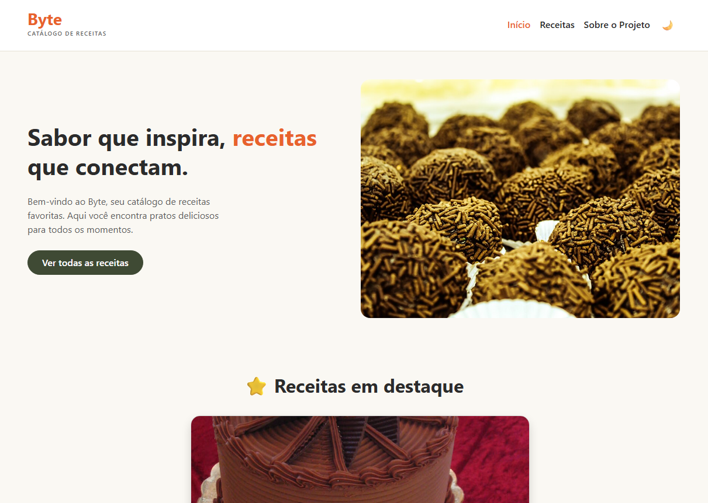
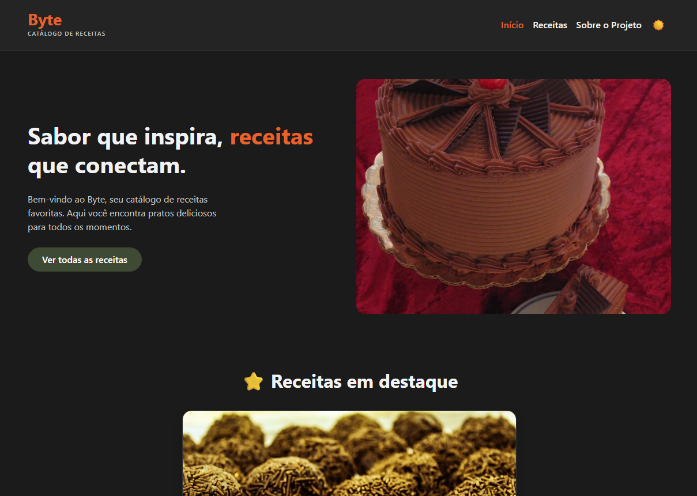

<div align="center">

# 🍳 Byte - Catálogo de Receitas

  <p align="center">
    Uma aplicação web moderna, rápida e intuitiva para explorar, buscar e visualizar receitas culinárias.
    <br />
  </p>
</div>

---

## 📌 Sobre o Projeto

O **Byte** é um catálogo de receitas digitais desenvolvido para oferecer uma experiência fluida de navegação. Sem necessidade de cadastro ou complicações, o usuário pode explorar receitas de forma dinâmica, filtrar por categorias, realizar buscas em tempo real e consultar detalhes completos de preparo.

A aplicação consome os dados de um arquivo JSON centralizado, simulando o comportamento de uma API para renderizar o conteúdo via JavaScript.

---

## 📱 Demonstração


| Modo Claro ☀️ | Modo Escuro 🌙 |
| :---: | :---: |
|  |  |

---

## ✨ Funcionalidades

- [x] **Tema Dinâmico (Dark/Light Mode):** Alternância instantânea de tema com salvamento de preferência via `localStorage` e suporte ao tema nativo do sistema.
- [x] **Carrossel Dinâmico de Destaques:** Destaques da página inicial gerados automaticamente a partir dos dados do JSON.
- [x] **Busca em Tempo Real:** Filtragem instantânea por nome da receita diretamente na listagem.
- [x] **Filtros e Ordenação:** Filtro dinâmico por categoria e ordenação alfabética (A-Z / Z-A).
- [x] **Roteamento Dinâmico por URL:** Template único de receita (`receita.html?id=...`) alimentado via URL Parameters (`URLSearchParams`).
- [x] **Design Responsivo:** Interface adaptada para smartphones, tablets e desktops utilizando Bootstrap 5.

---

## 🛠️ Tecnologias Utilizadas

O projeto foi construído utilizando as seguintes tecnologias e ferramentas:

| Tecnologia | Descrição |
|---|---|
| **HTML5** | Estrutura semântica e acessibilidade da aplicação. |
| **CSS3 / Variables** | Estilização customizada, suporte a temas e layout responsivo. |
| **JavaScript (ES6+)** | Manipulação do DOM, Fetch API, persistência local e lógica de filtros. |
| **Bootstrap 5** | Sistema de grid, componentes de UI e utilitários responsivos. |
| **JSON** | Armazenamento de dados do catálogo de receitas. |

---

## 📂 Estrutura de Arquivos

```text
byte-website/
├── css/
│   └── style.css                    # Estilos globais e variáveis de tema
├── data/
│   └── receitas.json                # Banco de dados estático em formato JSON
├── js/
│   ├── app.js                       # Lógica global (alternância de tema e menu)
│   ├── carrossel.js                 # Renderização dinâmica do carrossel da home
│   ├── detalhe-receita.js           # Lógica da página de detalhes individuais
│   └── listagem-receitas.js         # Lógica de busca, filtros, ordenação e paginação
├── img/                             # Imagens e favicons
├── index.html                       # Página inicial (Hero + Destaques)
├── receita.html                     # Página de detalhes do prato
├── listagem-receitas.html           # Listagem do catálogo completo
├── sobre.html                       # Apresentação do projeto e da equipe
└── README.md                        # Documentação do repositório
